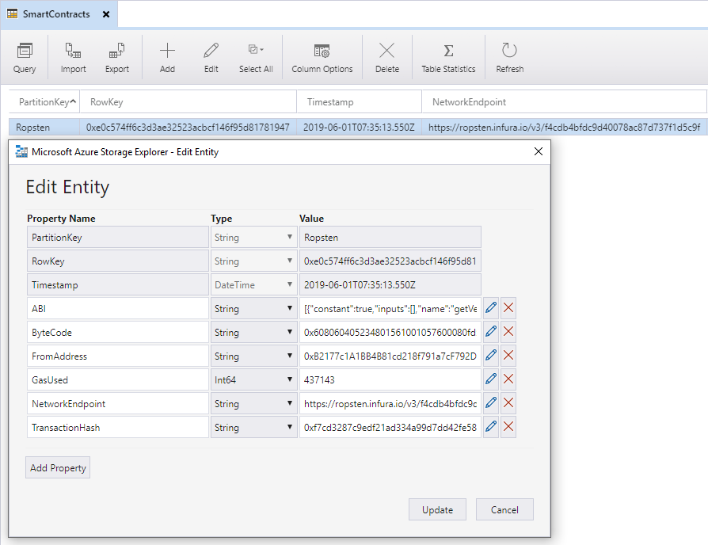

# SmartContractFunction
An Azure Function to call Ethereum Smart Contracts

## Info
| | |
| --- | --- |
| ***Quality*** | &nbsp; |
| &nbsp;&nbsp;**Build Azure** | [](https://stef.visualstudio.com/SmartContractFunction/_build/latest?definitionId=23) |

This solution uses Azure Table Storage to store the details from the Deployed Smart Contracts.

## Functionality

### DeploySmartContract

Use this to *deploy* a new Smart Contract to the Ethereum Blockchain.

#### Example
Do a **POST** request with this body to endpoint <http://localhost:7071/api/DeploySmartContract>

``` js
{
    "Endpoint": "https://ropsten.infura.io/v3/***",
    "ContractABI": "[{\"constant\":true,\"inputs\":[],\"name\":\"getVersion\",\"outputs\":[{\"name\":\"version\",\"type\":\"int256\"},{\"name\":\"description\",\"type\":\"string\"}],\"payable\":false,\"stateMutability\":\"view\",\"type\":\"function\"},{\"constant\":false,\"inputs\":[{\"name\":\"value\",\"type\":\"uint256\"}],\"name\":\"setNumber\",\"outputs\":[],\"payable\":false,\"stateMutability\":\"nonpayable\",\"type\":\"function\"},{\"constant\":false,\"inputs\":[{\"name\":\"value\",\"type\":\"string\"}],\"name\":\"setString\",\"outputs\":[],\"payable\":false,\"stateMutability\":\"nonpayable\",\"type\":\"function\"},{\"constant\":true,\"inputs\":[],\"name\":\"getString\",\"outputs\":[{\"name\":\"\",\"type\":\"string\"}],\"payable\":false,\"stateMutability\":\"view\",\"type\":\"function\"},{\"constant\":true,\"inputs\":[{\"name\":\"number1\",\"type\":\"uint256\"},{\"name\":\"number2\",\"type\":\"uint256\"}],\"name\":\"addNumbers\",\"outputs\":[{\"name\":\"\",\"type\":\"uint256\"}],\"payable\":false,\"stateMutability\":\"pure\",\"type\":\"function\"},{\"constant\":true,\"inputs\":[],\"name\":\"getNumber\",\"outputs\":[{\"name\":\"\",\"type\":\"uint256\"}],\"payable\":false,\"stateMutability\":\"view\",\"type\":\"function\"},{\"inputs\":[{\"name\":\"version\",\"type\":\"int256\"},{\"name\":\"description\",\"type\":\"string\"}],\"payable\":false,\"stateMutability\":\"nonpayable\",\"type\":\"constructor\"}]",
    "ContractByteCode": "0x608060405234801561001057600080fd5b506040516106123803806106128339810180604052604081101561003357600080fd5b81516020830180519193928301929164010000000081111561005457600080fd5b8201602081018481111561006757600080fd5b815164010000000081118282018710171561008157600080fd5b5050600085905580519093506100a092506001915060208401906100a8565b505050610143565b828054600181600116156101000203166002900490600052602060002090601f016020900481019282601f106100e957805160ff1916838001178555610116565b82800160010185558215610116579182015b828111156101165782518255916020019190600101906100fb565b50610122929150610126565b5090565b61014091905b80821115610122576000815560010161012c565b90565b6104c0806101526000396000f3fe608060405234801561001057600080fd5b506004361061007e577c010000000000000000000000000000000000000000000000000000000060003504630d8e6e2c81146100835780633fb5c1cb1461010a5780637fcaf6661461012957806389ea642f146101cf578063ef9fc50b1461024c578063f2c9ecd814610281575b600080fd5b61008b610289565b6040518083815260200180602001828103825283818151815260200191508051906020019080838360005b838110156100ce5781810151838201526020016100b6565b50505050905090810190601f1680156100fb5780820380516001836020036101000a031916815260200191505b50935050505060405180910390f35b6101276004803603602081101561012057600080fd5b5035610328565b005b6101276004803603602081101561013f57600080fd5b81019060208101813564010000000081111561015a57600080fd5b82018360208201111561016c57600080fd5b8035906020019184600183028401116401000000008311171561018e57600080fd5b91908080601f016020809104026020016040519081016040528093929190818152602001838380828437600092019190915250929550610344945050505050565b6101d761035b565b6040805160208082528351818301528351919283929083019185019080838360005b838110156102115781810151838201526020016101f9565b50505050905090810190601f16801561023e5780820380516001836020036101000a031916815260200191505b509250505060405180910390f35b61026f6004803603604081101561026257600080fd5b50803590602001356103f2565b60408051918252519081900360200190f35b61026f6103f6565b6000805460018054604080516020600284861615610100026000190190941693909304601f81018490048402820184019092528181526060949392909183918301828280156103195780601f106102ee57610100808354040283529160200191610319565b820191906000526020600020905b8154815290600101906020018083116102fc57829003601f168201915b50505050509050915091509091565b600a81101561033b576001600255610341565b60028190555b50565b80516103579060039060208401906103fc565b5050565b60038054604080516020601f60026000196101006001881615020190951694909404938401819004810282018101909252828152606093909290918301828280156103e75780601f106103bc576101008083540402835291602001916103e7565b820191906000526020600020905b8154815290600101906020018083116103ca57829003601f168201915b505050505090505b90565b0190565b60025490565b828054600181600116156101000203166002900490600052602060002090601f016020900481019282601f1061043d57805160ff191683800117855561046a565b8280016001018555821561046a579182015b8281111561046a57825182559160200191906001019061044f565b5061047692915061047a565b5090565b6103ef91905b80821115610476576000815560010161048056fea165627a7a72305820af39c0145ea4683cb6674df3f7bcb6dd04a63678d3e8c08c81c8e7d41e86180f0029",
    "CallerPrivateKey": "***",
    "ContractParameters": [123, "abc"],
    "FromAddress": "0x***"
}
```
After this call, the Smart Contract details (Address, ABI, ByteCode, ...) are stored in Azure Table Storage, in the table `SmartContracts` (specified in *local.settings.json* or in the *Environment Settings*)

### QuerySmartContractFunction (including the ABI)

Use this to call a *normal* function.

#### Example
Do a **POST** request with this body to endpoint <http://localhost:7071/api/QuerySmartContractFunction>

To call a function without parameters:
``` js
{
    "Endpoint": "https://ropsten.infura.io/v3/***",
    "ContractAddress": "0x***",
    "CallerPrivateKey": "***",
    "FunctionName": "getString",
    "FromAddress": "0x***"
}
```

To call a function with parameters:
``` js
{
    "Endpoint": "https://ropsten.infura.io/v3/***",
    "ContractAddress": "0x***",
    "CallerPrivateKey": "***",
    "FromAddress": "0x**",
    "FunctionName": "addNumbers",
    "FunctionParameters": [1, 4]
}
```
Note that the `ContractABI` can be specified, but this is not required because this can be retrieved from Azure Table Storage. 

### ExecuteSmartContractFunction

Use this to execute a *transactional* function.

#### Example
Do a **POST** request with this body to endpoint <http://localhost:7071/api/ExecuteSmartContractFunction>

To call a function with parameters:
``` js
{
    "Endpoint": "https://ropsten.infura.io/v3/***",
    "ContractAddress": "0x***",
    "CallerPrivateKey": "***",
    "FunctionName": "setString",
    "FromAddress": "0x**",
    "FunctionParameters": ["stef-1234"]
}
```
Note that the `ContractABI` can be specified, but this is not required because this can be retrieved from Azure Table Storage.


## Azure Table Storage
Just create a table named `SmartContracts` in your account. When deploying a new Smart Contract, this will be stored and looks like this:


